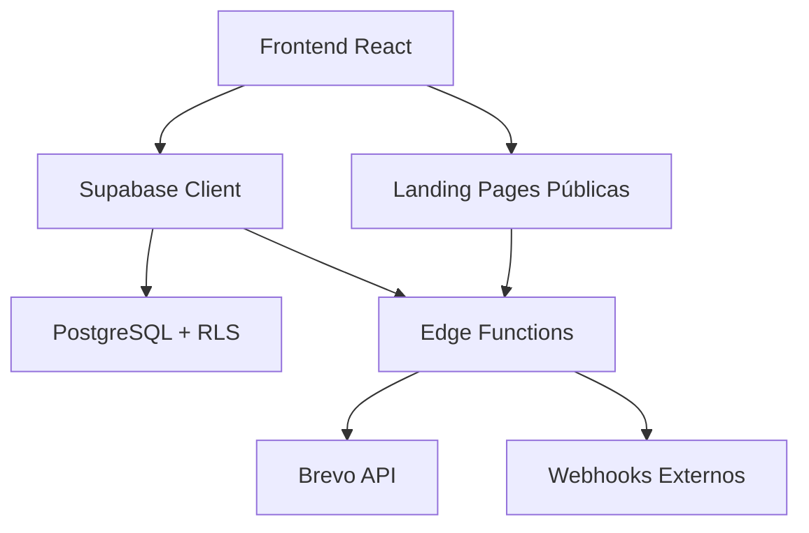

# 🏗️ Arquitetura do Sistema

## 📐 Visão Geral



## 🎨 Frontend

### Estrutura de Pastas

```
src/
├── components/
│   ├── ui/              # shadcn components
│   ├── dashboard/       # Dashboard específicos
│   ├── campanha/        # Gestão de campanhas
│   ├── leads/           # Gestão de leads
│   ├── landing/         # Landing pages
│   ├── layout/          # Header, Footer
│   └── onboarding/      # Wizard inicial
├── pages/               # Páginas principais
├── hooks/               # Custom hooks
├── lib/                 # Utilities
└── integrations/        # Supabase client
```

### Principais Rotas

- `/` - Auth/Login
- `/dashboard` - Dashboard principal
- `/campanhas` - Lista de campanhas
- `/campanha/:id` - Detalhes da campanha
- `/leads` - Gestão de leads
- `/captura` - Landing pages
- `/lp/:campanhaId` - Landing page pública

## 🗄️ Backend (Supabase)

### Tabelas Principais

**clientes**
- user_id → auth.users
- Configurações de landing page
- Webhook URL padrão

**campanhas**
- cliente_id → clientes
- Textos personalizados
- Tema visual
- Status (ativa/pausada)

**leads**
- campanha_id → campanhas
- cliente_id → clientes
- Status, origem, notas
- Triggers para métricas

**email_templates**
- Corpo HTML
- Variáveis dinâmicas

**metricas_campanha**
- Agregações diárias
- Leads por origem
- Conversões

### RLS Policies

Todas as tabelas possuem RLS ativo:
- Usuários veem apenas dados vinculados ao seu `user_id`
- Landing pages públicas acessam via views sem RLS

## ⚡ Edge Functions

### webhook-lead
- Recebe leads da landing page
- Insere no banco
- Dispara webhook externo
- Envia email automático (se ativo)

### send-campaign-email
- Recebe: leadId, templateId, campanhaId
- Busca dados no Supabase
- Personaliza template com variáveis
- Envia via Brevo API
- Loga resultado em email_logs

### update-lead-status
- Atualiza status do lead
- Valida status permitido
- Atualiza métricas

## 🔗 Integrações

### Brevo (Email)
- API Key via secret
- Envio transacional
- Tracking de emails

### Webhooks
- POST para URL configurada
- Payload JSON com dados do lead
- Timeout: 30s

---

Veja [API-REFERENCE.md](./API-REFERENCE.md) para detalhes das APIs.
