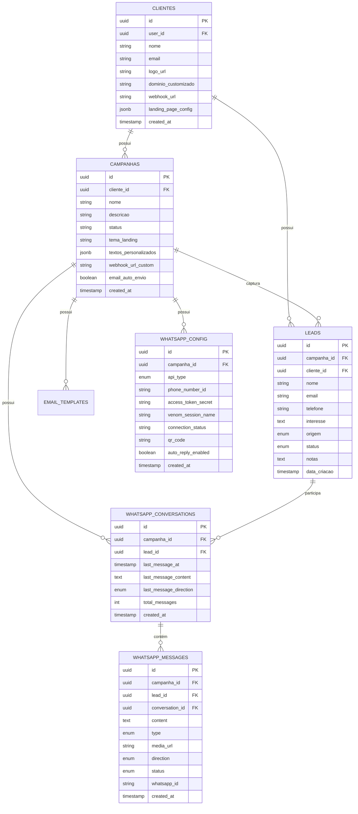
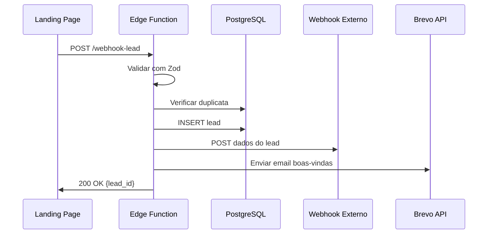
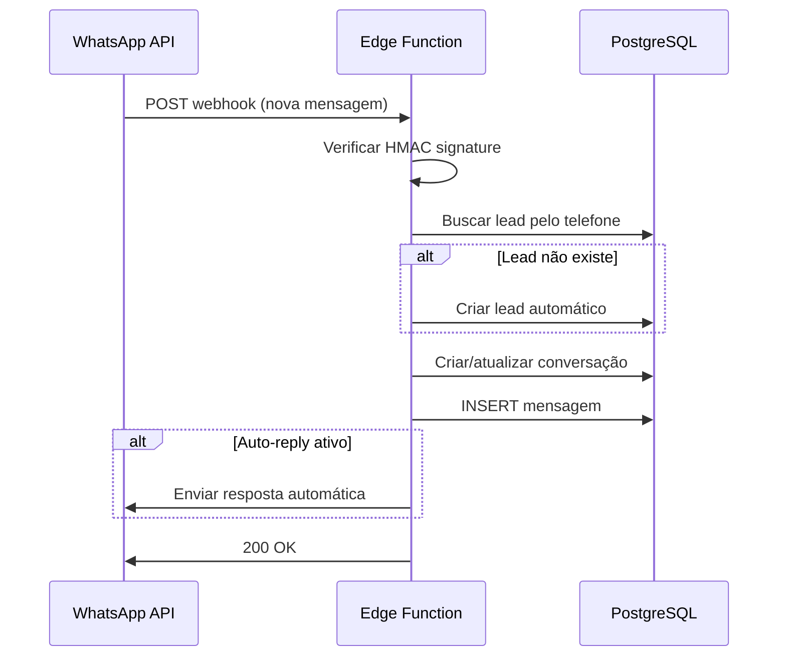

# 🏗️ Arquitetura do Sistema - Plataforma de Marketing e Vendas

## 📐 Visão Geral

```mermaid
graph TB
    subgraph "Frontend - React App"
        A[React 18 + TypeScript]
        B[Tailwind CSS + shadcn/ui]
        C[React Query + Zod]
        D[Next Themes - Dark/Light]
    end
    
    subgraph "Backend - Supabase"
        E[PostgreSQL + RLS]
        F[Edge Functions - Deno]
        G[Realtime - WebSockets]
        H[Auth - JWT]
        I[Storage]
    end
    
    subgraph "Integrações Externas"
        J[Brevo API - Email]
        K[WhatsApp Business API]
        L[Venom/Baileys API]
        M[Webhooks N8N/Make]
    end
    
    subgraph "Landing Pages Públicas"
        N[/lp/:campanhaId]
        O[Domínios Customizados]
    end
    
    A --> E
    A --> F
    A --> G
    F --> E
    F --> J
    F --> K
    F --> L
    F --> M
    N --> F
    O --> F
    
    style A fill:#61dafb
    style E fill:#3ecf8e
    style F fill:#3ecf8e
    style J fill:#0092ff
    style K fill:#25d366
```

## 🎨 Frontend Architecture

### Estrutura de Pastas Detalhada

```
src/
├── components/
│   ├── ui/                    # Componentes shadcn/ui base
│   │   ├── button.tsx
│   │   ├── card.tsx
│   │   ├── dialog.tsx
│   │   ├── sheet.tsx         # Modal lateral
│   │   ├── tabs.tsx
│   │   ├── skeleton.tsx      # Loading states
│   │   └── ...
│   │
│   ├── dashboard/             # Dashboard específicos
│   │   ├── StatCard.tsx
│   │   ├── QuickActions.tsx
│   │   ├── RecentActivity.tsx
│   │   └── MetricasAvancadas.tsx
│   │
│   ├── campanha/              # Gestão de campanhas
│   │   ├── ConfiguracoesCampanha.tsx
│   │   ├── EmailsCampanha.tsx
│   │   ├── LeadsCampanha.tsx
│   │   ├── MetricasCampanha.tsx
│   │   ├── WhatsAppCampanha.tsx      # Novo!
│   │   └── EditarLandingPageCampanha.tsx
│   │
│   ├── leads/                 # Gestão de leads
│   │   ├── FiltrosLeads.tsx
│   │   ├── ImportarCSV.tsx
│   │   └── ExportarCSV.tsx
│   │
│   ├── landing/               # Landing pages
│   │   ├── LandingPageRenderer.tsx
│   │   ├── EditarLandingPage.tsx
│   │   ├── PreviewModal.tsx
│   │   └── TemasLanding.tsx
│   │
│   ├── whatsapp/              # WhatsApp Business - Novo!
│   │   ├── WhatsAppSidebar.tsx        # Sidebar com campanhas
│   │   ├── ConversationList.tsx       # Lista de conversas
│   │   ├── ChatInterface.tsx          # Interface de chat
│   │   ├── MessageBubble.tsx          # Bolhas de mensagem
│   │   ├── EnviarMensagemWhatsApp.tsx # Envio de mensagens
│   │   ├── ConfigurarWhatsAppOficial.tsx  # Config API Oficial
│   │   ├── ConfigurarWhatsAppVenom.tsx    # Config Venom
│   │   ├── ConfigurarChatwoot.tsx     # Config Chatwoot
│   │   ├── TemplateWhatsApp.tsx       # Templates
│   │   ├── HistoricoWhatsApp.tsx      # Histórico
│   │   └── WhatsAppConfigSheet.tsx    # Sheet de configurações
│   │
│   ├── layout/                # Layout e navegação
│   │   ├── Header.tsx         # Header público
│   │   ├── HeaderInterno.tsx  # Header autenticado
│   │   └── Footer.tsx
│   │
│   ├── onboarding/            # Wizard inicial
│   │   └── OnboardingWizard.tsx
│   │
│   └── webhooks/              # Configuração de webhooks
│       └── ConfigurarWebhook.tsx
│
├── pages/                     # Páginas principais (React Router)
│   ├── Index.tsx              # Home pública
│   ├── Auth.tsx               # Login/Cadastro
│   ├── Dashboard.tsx          # Dashboard principal
│   ├── Campanhas.tsx          # Lista de campanhas
│   ├── CampanhaDetalhes.tsx   # Detalhes da campanha
│   ├── Leads.tsx              # Gestão de leads
│   ├── LandingPage.tsx        # Editor de landing pages
│   ├── Captura.tsx            # Preview e compartilhamento
│   ├── WhatsApp.tsx           # Central WhatsApp - Novo!
│   ├── Clientes.tsx           # Gestão de clientes
│   ├── ClienteDetalhes.tsx    # Detalhes do cliente
│   └── NotFound.tsx           # 404
│
├── hooks/                     # Custom React hooks
│   ├── use-mobile.tsx
│   └── use-toast.ts
│
├── lib/                       # Utilitários e helpers
│   ├── utils.ts               # Funções utilitárias
│   └── validations/           # Schemas Zod - Novo!
│       └── whatsapp.ts        # Validações WhatsApp
│
├── providers/                 # Context providers
│   └── ThemeProvider.tsx      # Dark/Light mode - Novo!
│
├── integrations/              # Integrações externas
│   └── supabase/
│       ├── client.ts          # Cliente Supabase
│       └── types.ts           # Tipos gerados (read-only)
│
├── assets/                    # Imagens e assets
│   ├── core-logo.png
│   ├── preview-*.jpg          # Previews de temas
│   └── ...
│
├── App.tsx                    # Root component
├── main.tsx                   # Entry point
└── index.css                  # Design system (HSL colors)
```

### Design System e Temas

#### Cores Principais (HSL)

```css
/* index.css */
:root {
  /* Brand Colors */
  --core-black: 0 0% 0%;
  --core-green: 158 100% 43%;
  --core-yellow: 62 100% 65%;
  --core-purple: 280 61% 82%;
  --core-white: 0 0% 100%;
  
  /* Semantic Tokens */
  --background: var(--core-white);
  --foreground: var(--core-black);
  --primary: var(--core-black);
  --secondary: var(--core-green);
  --accent: var(--core-yellow);
  
  /* Gradients */
  --gradient-primary: linear-gradient(135deg, hsl(var(--core-black)), hsl(var(--core-green)));
  --gradient-hero: linear-gradient(135deg, hsl(var(--core-black)) 0%, hsl(var(--core-green)) 50%, hsl(var(--core-yellow)) 100%);
}

.dark {
  --background: var(--core-black);
  --foreground: var(--core-white);
  --primary: var(--core-white);
  /* ... outros tokens dark */
}
```

#### Componentes Customizados

Todos os componentes shadcn/ui são customizados com variantes específicas:

```typescript
// Exemplo: Button variants
const buttonVariants = cva(
  "...",
  {
    variants: {
      variant: {
        default: "bg-primary text-primary-foreground",
        secondary: "bg-secondary text-secondary-foreground",
        ghost: "hover:bg-accent/10",
        // ... custom variants
      }
    }
  }
)
```

### Principais Rotas

| Rota | Público | Descrição |
|------|---------|-----------|
| `/` | ✅ | Home/Landing institucional |
| `/auth` | ✅ | Login e cadastro |
| `/lp/:campanhaId` | ✅ | Landing page pública da campanha |
| `/dashboard` | ❌ | Dashboard principal (autenticado) |
| `/campanhas` | ❌ | Lista de campanhas |
| `/campanha/:id` | ❌ | Detalhes e edição de campanha |
| `/leads` | ❌ | Gestão de leads |
| `/whatsapp` | ❌ | Central WhatsApp Business |
| `/whatsapp/:campanhaId` | ❌ | WhatsApp filtrado por campanha |
| `/captura` | ❌ | Landing pages e compartilhamento |
| `/clientes` | ❌ | Gestão de clientes |

### State Management

**React Query** para dados do servidor:
```typescript
// Exemplo de query
const { data: leads, isLoading } = useQuery({
  queryKey: ['leads', campanhaId],
  queryFn: async () => {
    const { data } = await supabase
      .from('leads')
      .select('*')
      .eq('campanha_id', campanhaId);
    return data;
  }
});
```

**React Hooks** para estado local:
```typescript
const [selectedLead, setSelectedLead] = useState<Lead | null>(null);
const [filters, setFilters] = useState<Filters>({ status: 'all' });
```

---

## 🗄️ Backend Architecture (Supabase)

### Database Schema



### Principais Tabelas

#### clientes
- Vínculo com `auth.users` via `user_id`
- Configurações de landing page padrão
- Webhook URL padrão
- Domínio personalizado

#### campanhas
- Vinculadas a um cliente
- Textos personalizados (headline, subtítulo, CTA)
- Tema visual (6 opções)
- Status (ativa/pausada)
- Configurações de email auto-envio

#### leads
- Vinculados a campanha e cliente
- Status: novo, qualificado, convertido, perdido
- Origem: formulario, csv, n8n, whatsapp, manual
- Notas e histórico de interações

#### email_templates
- Templates HTML personalizáveis
- Variáveis dinâmicas ({{nome}}, {{email}}, etc.)
- Tipos: boas-vindas, follow-up, promocional

#### whatsapp_config *(Novo!)*
- Configuração por campanha
- Suporte para API Oficial e Venom
- Credenciais criptografadas
- Status de conexão
- QR Code (para Venom)

#### whatsapp_conversations *(Novo!)*
- Uma conversa por lead/campanha
- Última mensagem e timestamp
- Contador de mensagens
- Direção da última mensagem

#### whatsapp_messages *(Novo!)*
- Todas as mensagens enviadas e recebidas
- Tipo: text, image, document
- Status: sent, delivered, read, failed
- WhatsApp ID para rastreamento

### Row Level Security (RLS)

**Política de Segurança**: Todos os dados são isolados por `user_id`.

```sql
-- Exemplo: Política para tabela leads
CREATE POLICY "Users can view their own leads"
  ON public.leads
  FOR SELECT
  USING (
    EXISTS (
      SELECT 1 FROM public.clientes
      WHERE clientes.id = leads.cliente_id
        AND clientes.user_id = auth.uid()
    )
  );

CREATE POLICY "Users can insert their own leads"
  ON public.leads
  FOR INSERT
  WITH CHECK (
    EXISTS (
      SELECT 1 FROM public.clientes
      WHERE clientes.id = leads.cliente_id
        AND clientes.user_id = auth.uid()
    )
  );

-- Políticas similares para UPDATE e DELETE
```

**Views Públicas**: Landing pages acessam via views sem RLS.

---

## ⚡ Edge Functions (Deno Runtime)

### Arquitetura das Edge Functions

```
supabase/functions/
├── webhook-lead/              # Receber leads
│   └── index.ts
├── send-campaign-email/       # Enviar emails
│   └── index.ts
├── update-lead-status/        # Atualizar status
│   └── index.ts
├── whatsapp-send-message/     # Enviar WhatsApp - Novo!
│   └── index.ts
├── whatsapp-receive-webhook/  # Receber WhatsApp - Novo!
│   └── index.ts
└── whatsapp-test-connection/  # Testar conexão - Novo!
    └── index.ts
```

### webhook-lead
**Responsabilidades**:
- Validar payload com Zod
- Verificar duplicatas (email + campanha)
- Inserir lead no banco
- Disparar webhook externo (se configurado)
- Enviar email automático (se ativo)
- Retornar confirmação

**Fluxo**:


### send-campaign-email
**Responsabilidades**:
- Buscar template e lead
- Substituir variáveis ({{nome}}, etc.)
- Enviar via Brevo API
- Registrar log de envio

### whatsapp-send-message *(Novo!)*
**Responsabilidades**:
- Validar payload (Zod)
- Rate limiting (10 msg/min por campanha)
- Buscar config (oficial ou venom)
- Enviar via API apropriada
- Criar/atualizar conversação
- Salvar mensagem no banco
- HTML sanitization

**Validação**:
```typescript
const sendMessageSchema = z.object({
  campanhaId: z.string().uuid(),
  leadId: z.string().uuid(),
  message: z.string().min(1).max(4096),
  type: z.enum(['text', 'image', 'document']).default('text'),
});
```

**Rate Limiting**:
```typescript
const rateLimitKey = `whatsapp_send_${campanhaId}`;
if (!checkRateLimit(rateLimitKey, 10)) {
  return new Response('Rate limit exceeded', { status: 429 });
}
```

### whatsapp-receive-webhook *(Novo!)*
**Responsabilidades**:
- Verificar assinatura HMAC do WhatsApp
- Identificar lead pelo telefone
- Criar lead se não existir
- Criar/atualizar conversação
- Salvar mensagem recebida
- Resposta automática (se habilitada)

**Fluxo**:


### whatsapp-test-connection *(Novo!)*
**Responsabilidades**:
- Buscar config da campanha
- Testar credenciais API Oficial
- Verificar sessão Venom
- Retornar status detalhado

---

## 🔗 Integrações Externas

### Brevo API (Email)
**Endpoint**: `https://api.brevo.com/v3/smtp/email`

**Secrets Necessários**:
```bash
BREVO_API_KEY=xkeysib-...
```

**Uso**:
```typescript
const response = await fetch('https://api.brevo.com/v3/smtp/email', {
  method: 'POST',
  headers: {
    'api-key': Deno.env.get('BREVO_API_KEY'),
    'Content-Type': 'application/json',
  },
  body: JSON.stringify({
    sender: { email: 'noreply@example.com', name: 'Empresa' },
    to: [{ email: lead.email, name: lead.nome }],
    subject: 'Bem-vindo!',
    htmlContent: templateHTML,
  }),
});
```

### WhatsApp Business API (Oficial)
**Endpoint**: `https://graph.facebook.com/v18.0/{phone_number_id}/messages`

**Configuração**:
- Business Account ID
- Phone Number ID
- Access Token (permanente)
- Webhook Verify Token

**Exemplo de Envio**:
```typescript
const body = {
  messaging_product: 'whatsapp',
  to: phone.replace(/\D/g, ''),
  type: 'text',
  text: { body: message }
};

const response = await fetch(url, {
  method: 'POST',
  headers: {
    'Authorization': `Bearer ${access_token}`,
    'Content-Type': 'application/json',
  },
  body: JSON.stringify(body),
});
```

### Venom/Baileys (Não-oficial)
**Configuração**:
- Session Name
- Webhook URL
- QR Code para autenticação

**Diferenças**:
| Feature | API Oficial | Venom |
|---------|-------------|-------|
| Custo | Pago (Meta) | Gratuito |
| Confiabilidade | Alta | Média |
| Templates | Obrigatório | Não |
| Verificação | Badge verde | Não |
| Rate Limit | 1000/dia | Ilimitado* |

*Sujeito a banimento se abusar.

### N8N / Make / Zapier
**Webhook Format**:
```json
POST https://seu-webhook.com/endpoint
Content-Type: application/json

{
  "id": "uuid",
  "nome": "João",
  "email": "joao@email.com",
  // ... outros campos
}
```

**Timeout**: 30 segundos

---

## 🔒 Segurança

### Autenticação
- JWT Tokens via Supabase Auth
- Refresh tokens automáticos
- Session management

### Autorização
- Row Level Security (RLS) em todas as tabelas
- Policies baseadas em `user_id`
- Isolamento total de dados entre usuários

### Validação de Dados
- Zod schemas em Edge Functions
- React Hook Form + Zod no frontend
- Sanitização HTML em mensagens WhatsApp

### Secrets Management
- Todas as chaves API no Supabase Secrets
- Nunca expor secrets no código
- Rotação de tokens recomendada

### Rate Limiting
- WhatsApp: 10 msg/min por campanha
- Email: 50 msg/min por campanha
- Webhooks: 100 req/min por cliente

### CORS
- Configurado para permitir domínios específicos
- Headers de segurança habilitados

---

## 📊 Performance e Escalabilidade

### Frontend
- **Code Splitting**: Lazy loading de rotas
- **Memoização**: React.memo em componentes pesados
- **Virtual Scrolling**: Listas grandes (react-window)
- **Skeleton Loading**: Feedback visual imediato

### Backend
- **Connection Pooling**: Supabase Pooler
- **Índices**: Otimizados para queries frequentes
- **Triggers**: Atualização de métricas em background

### Caching
- React Query cache automático
- Stale-while-revalidate strategy
- Cache de assets (Vite)

---

## 🚀 Deploy e CI/CD

### Frontend
- Build: Vite (ESBuild)
- Deploy: Lovable (automático)
- CDN: Global edge network

### Backend
- Migrations: Automáticas via Supabase
- Edge Functions: Deploy automático via Git push
- Rollback: Versioning nativo

---

Para mais detalhes, consulte:
- [API-REFERENCE.md](./API-REFERENCE.md) - Endpoints e payloads
- [MANUAL-DEPLOY.md](./MANUAL-DEPLOY.md) - Setup e configuração
- [MANUAL-USUARIO.md](./MANUAL-USUARIO.md) - Guia de uso
